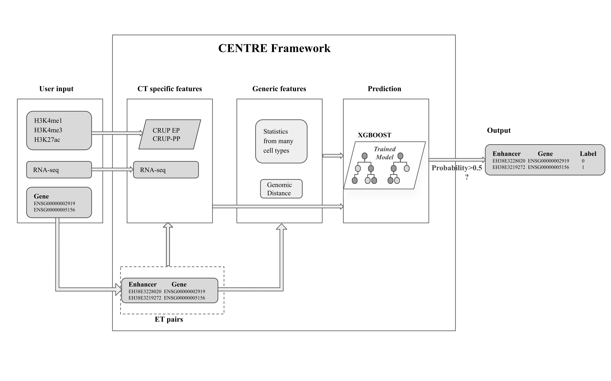

# *CENTRE - Short description*
CENTRE is a machine learning framework that predicts enhancer target 
interactions in a cell-type-specific manner, using only gene expression and 
ChIP-seq data for three histone modifications for the cell type of interest.
 CENTRE uses various available datasets and extracts cell-type agnostic 
statistics to complement the cell-type specific information.



### Contact

- Sara Lopez lopez_s@molgen.mpg.de
- Trisevgeni Rapakoulia rapakoul@molgen.mpg.de
### Citation


## Requirements
- R (tested 4.0.0)
- crupR
- GenomicRanges and IRanges
- metapod
- RSQLite
- xgboost

## User Provided Data

CENTRE computes its features for classification based on user provided Histone ChIP-seq 
(H3K27ac, H3K4me3 and H3K4me1 ) and RNA-seq data for the cell-type of inetrest. 
As a dataframe with the genes of interest or the genes and enhancer pairs of interest.

User data : 
- Cell-type specific histone ChIP-seq in BAM format for H3K27ac, H3K4me3 and H3K4me1. 
Additionally, a Control ChIP-seq experiment to match the HM ChIP-seq is strongly advised 
but CENTRE can also run without it.
- Cell -type specific RNA-seq TPM values for all genes. This dataframe will have three 
columns one with the ENSEMBL ID's, transcript ID's and one with the TPM values for all genes.
- A dataframe with either the GENCODE ID's for the genes of interest or enhancer (cCREs-ELS) 
target (GENCODE ID's) pairs of interest.

## CENTRE Generic Information

CENTRE uses precomputed datasets that the user needs to download either by using
the `CENTRE::downloadPredcomputedData()` or downloading the data from http://owww.molgen.mpg.de/~CENTRE_data/PrecomputedData.db
and adding it to the /inst/extdata folder. 

PrecomputedData.db is a database containing precomputed Wilcoxon rank sum 
tests on the following data sets:
- CAGE-seq dataset (Andersson et al.,2014) 
- DNAse hypersensitivity dataset (Thurman et al.,2012)
- DNAse-seq gene expression dataset (Sheffield et al.,2013)
- CRUP-EP gene expression dataset 
- Pearson Correlation between CRUP-EP(Enhancer Probability) and CRUP-PP
(Promoter Probability) across 104 cell types


## Installing CENTRE
```
#Install the development version of crupR
if (!require("devtools", quietly = TRUE))
    install.packages("devtools")
devtools::install_git("https://github.com/akbariomgba/crupR.git")
#Say yes to installing all required dependencies

#Install the development version of CENTRE
devtools::install_git("https://github.com/slrvv/CENTRE.git")
#Say yes to installing all required dependencies
```
Note: If the installation of any of the dependencies of CENTRE fails
try running the script CENTRE/install/install_CENTRE.R

## References

- Andersson,R. et al. (2014) An atlas of active enhancers across human cell types and tissues. Nature, 507, 455–461.
- Thurman,R.E. et al. (2012) The accessible chromatin landscape of the human genome. Nature, 489, 75–82.
- Sheffield,N.C. et al. (2013) Patterns of regulatory activity across diverse human cell types predict tissue identity, transcription factor binding, and long-range interactions. Genome Res., 23, 777–788.

