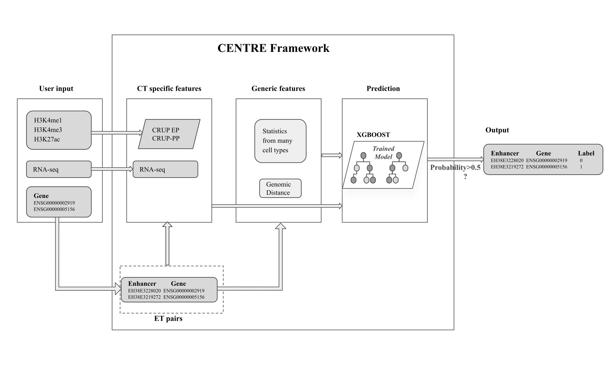

```{r setup, include=FALSE}
knitr::opts_chunk$set(
    collapse = TRUE,
    comment = "#>"
)
```

# Installation
```{r installation, eval=FALSE}
if (!require("BiocManager", quietly = TRUE)) {
    install.packages("BiocManager")
}
BiocManager::install("CENTRE")
```

CENTRE uses pre-computed tests and annotations from the packages 
CENTREprecomputed and CENTREannotations, make sure to install them.

```{r installation depend, eval=FALSE}
BiocManager::install("CENTREprecomputed")
BiocManager::install("CENTREannotation")
```
# Overview


The *CENTRE* pipeline follows the workflow below. Two use cases :

1. User has only genes: `createPairs()` -> `computeGenericFeatures()` ->
`computeCellTypeFeatures()` -> `centreClassification()`

2. User has gene enhancer pairs : `computeGenericFeatures()` ->
 `computeCellTypeFeatures()` -> `centreClassification()`

**Citation**

Trisevgeni Rapakoulia, Sara Lopez Ruiz De Vargas, Persia Akbari Omgba, Verena 
Laupert, Igor Ulitsky, Martin Vingron, CENTRE: a gradient boosting algorithm 
for Cell-type-specific ENhancer-Target pREdiction, Bioinformatics, Volume 39, 
Issue 11, November 2023, btad687, https://doi.org/10.1093/bioinformatics/btad687


# Getting started
In order to run *CENTRE* you will need the following :

- Cell-type specific Histone (HM) ChIP-seq in BAM format for H3K27ac, H3K4me3 and 
H3K4me1. Additionally, a Control ChIP-seq experiment to match the HM ChIP-seq is
recommended but CENTRE can also run without it.
- Cell-type specific RNA-seq TPM values for all genes. This data.frame will have
three columns one with the ENSEMBL ID's, transcript ID's and one with the TPM 
values for all genes.
- A data.frame with either the GENCODE ID's for the genes of interest or enhancer
(cCREs-ELS) and target (GENCODE ID's) pairs of interest.

# Run the *CENTRE* pipeline

## Example Data
We provide an in-package example on the cell line HeLa-S3. The Histone Mark
and RNA-seq data are from ENCODE and correspond to the following experiments:

| Experiment type| ENCODE experiment accession | File accession numbers|
| :------------  |   :------------------:      |    ----------------:  |
| H3K4me1        |ENCSR000APW| ENCFF712AAP, ENCFF826OLG|
| H3K4me3        | ENCSR340WQU|ENCFF650IXI, ENCFF760VTC |
| H3K27ac        |ENCSR000AOC | ENCFF609ZAE, ENCFF711QAI |
| ChIP-seq Control| ENCSR000AOB|ENCFF017QCL, ENCFF842IEZ|
| RNA-seq        | ENCSR000CPP |ENCFF297BJF, ENCFF623UDU


For the Histone ChIP-seq replicates were merged using bamtools merge, separated
by chromosome using bamtools split and indexed using bamtools index.
For RNA-seq data we take the mean of the TPM values over the replicates. 
The example BAM are reduced to only contain region chr19 46788301 46797200, to 
make them smaller.

## Step 1: Create gene enhancer pairs
If you are in use case one you will need to use `createPairs()`. This
function finds all enhancers in 500kb from the transcription start site of the
input genes and creates all possible enhancer gene pairs.

It takes as input a vector `genes` with ENSEMBL gene ID's.
The output is a dataframe of two columns one with the gene ID's (without version
identifier) and the corresponding ENCODE cCREs enhancer ID's.

It also has a mode where pairs are computed from ENCODE cCREs enhancer ID's.
```{r run-createpairs}
library(CENTRE)
ids <- c("ENSG00000130203.10", "ENSG00000171119.3")

pairs <- createPairs(ids)
head(pairs)
# pairs computed from enhancer
ids_enh <- c("EH38E3750708", "EH38E2776554")
pairs_enh <- createPairs(ids_enh, enhancerCentered = TRUE)
head(pairs_enh)
```

## Step 2: Compute Generic Features
The function `computeGenericFeatures(pairs)` computes the features that are not
cell type specific.

Takes as input a data.frame `pairs` with the same format as the output of 
`createPairs()`.
The function returns a data.frame with the following features as columns:

- `distance`: The distance between the middle point of the enhancer and the
transcription start site of the gene in each pair.
- `cor_CRUP`: The CRUP correlation for each pair. This is one of the pre-
computed data sets in CENTREprecomputed.
- `combined_tests`: The combined p-values of all of the pre-computed Wilcoxon
tests. This is one of the pre-computed data sets in CENTREprecomputed.

```{r computegenericfeat, eval = FALSE}
generic_features <- computeGenericFeatures(pairs)
```

## Step 3: Compute Cell Type Features
The function `computeCellTypeFeatures()` computes the features that are cell 
type specific.Takes as input the following

- `metaData`: Data.frame with the path to the cell type specific ChIP-seq
experiments.
- `replicate`: The number of replicates of the ChIP-seq experiments
that need to be normalized.
- `input.free`: Boolean value indicating whether a Control/Input ChIP-seq
experiment is provided to go with the Histone Modification ChIP-seq experiments.
If the parameter is set to FALSE the normalization of ChIP-seq experiments
will be run in input.free mode.
- `cores`: Integer indicating how many cores the crupR normalization should be 
run with.
- `sequencing`: String "single" or "paired" indicating the type of sequencing of
the histone ChIP-seq experiments.
- `tpmData`: RNA-seq gene quantification data in R data.frame format. The R 
data.frame has to have 3 columns, one for the `gene_id` (ENSEMBL ID), 
one for the `transcript_ids` (ENSEMBL ID) and one for the TPM value.
- `chr`: NULL or a vector of chromosomes. Use only if the crupR
normalization should be done for certain chromosomes. If this parameter is
not used crupR normalization is done for all chromosomes.
Using only certain chromosomes for normalization might change results
and is not the intended used of crupR or CENTRE.
- `pairs`: The data.frame of enhancer gene pairs that was produced in 
`createPairs()`

Example of the tpm dataframe: 

|gene_id | transcript_id.s.| TPM |
| :----- | :-------------: | --: |
| ENSG00000000003.14 | ENST00000373020.8,ENST00000494424.1, ...| 25.635
| ENSG00000000005.5 | ENST00000373031.4,ENST00000485971.1, ... | 0.000
| ENSG00000000419.12 | ENST00000371582.8,ENST00000371584.8, ... | 55.915
| ENSG00000000457.13 | ENST00000367770.5,ENST00000367771.10, ... |  4.660
| ... | ... | ... |

Returns the cell type specific features : 

- `EP_prob_enh`: CRUP-EP(Enhancer Probability) for Enhancers
- `EP_prob_gene`: CRUP-EP(Enhancer Probability) for Promoters
- `reg_dist_enh`: Regulatory distance computed on enhancer probabilities
- `norm_reg_dist_enh`: Normalized regulatory distance computed on enhancer probabilities
- `PP_prob_enh`: CRUP-PP(Promoter Probability) for Enhancers
- `PP_prob_gene`: CRUP-PP(Promoter Probability) for Promoters
- `reg_dist_enh`: Regulatory distance computed on promoter probabilities
- `norm_reg_dist_enh`: Normalized regulatory distance computed on promoter probabilities
- `TPM`: RNA-seq TPM values for the gene in each pair of the cell type of interest.

First prepare the metadata and tpm dataframes and then run the function.

*!IMPORTANT NOTE*: In this example we use data only for chromosome 19 to make it 
faster and make the BAM files occupy less memory. In order for CENTRE to run as 
intended the user should provide genome-wide BAM files and leave `chr` parameter 
as NULL.

```{r computecelltypefeat}
# For the sake of space the BAM files in this example have been reduced to a
# small regions so we provide two pairs that are located in this region.
pairs <- data.frame(
    gene_id1 = c("ENSG00000105281", "ENSG00000105281"),
    enhancer_id = c("EH38E1958626", "EH38E3310851")
)

generic_features <- CENTRE::computeGenericFeatures(pairs)


# Compute Cell-type features
eh <- ExperimentHub::ExperimentHub()
## we might need to redo this
files <- c(
    system.file("extdata",
        "example/HeLa_H3K4me1.REF_chr19_reduced.bam",
        package = "CENTRE"
    ),
    system.file("extdata",
        "example/HeLa_H3K4me3.REF_chr19_reduced.bam",
        package = "CENTRE"
    ),
    system.file("extdata",
        "example/HeLa_H3K4me3.REF_chr19_reduced.bam",
        package = "CENTRE"
    )
)
inputs <- system.file("extdata",
    "example/HeLa_input.REF_chr19_reduced.bam",
    package = "CENTRE"
)
metaData <- data.frame(
    HM = c("H3K4me1", "H3K4me3", "H3K27ac"),
    condition = c(1, 1, 1), replicate = c(1, 1, 1),
    bamFile = files, inputFile = rep(inputs, 3)
)

tpmpath <- unname(eh[["EH9545"]])
tpmfile <- read.table(tpmpath,
    sep = "",
    stringsAsFactors = FALSE,
    header = TRUE
)

celltype_features <- computeCellTypeFeatures(metaData,
    replicate = 1,
    input.free = FALSE,
    cores = 2,
    sequencing = "single",
    tpmData = tpmfile,
    chr = "chr19",
    pairs = pairs
)
```

### Step 4: Classify Gene Enhancer Pairs

With the function `centrePrediction(features_generic, features_celltype, model)`
the gene enhancer targets are classified as active or inactive.
The function takes as input the generic features, the cell type specific features
and the model (CENTRE model by default).

Returns a dataframe with the `pairs` ID `enhancer_id` and `gene_id` concatenated
by a `_` of the corresponding pair and the label and probability for each of the pairs.
R
```{r prediction, eval = F}
# Finally compute the predictions
predictions <- centrePrediction(
    celltype_features,
    generic_features
)
```

```{r session}
sessionInfo()
```
